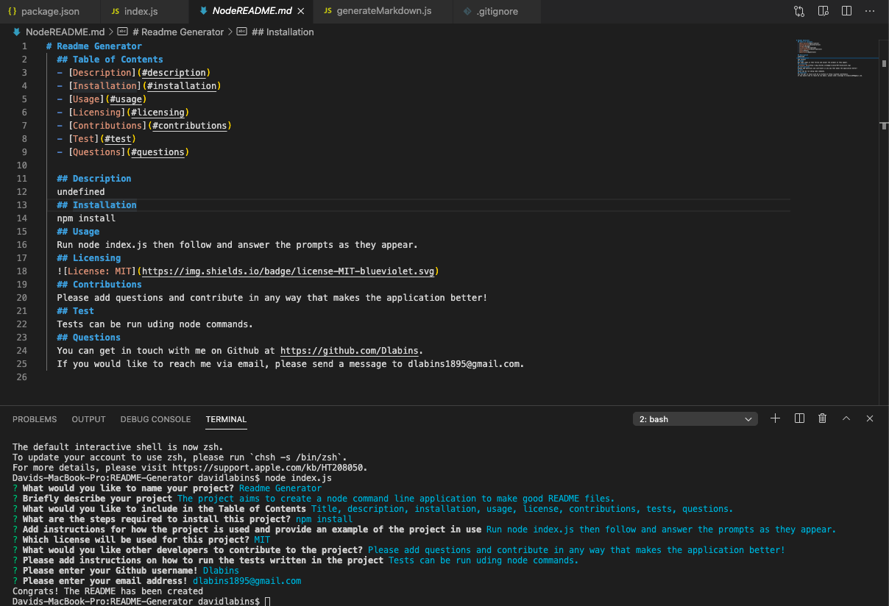

# README-Generator
## Table of Contents
  - [Description](#description)
  - [Installation](#installation)
  - [Usage](#usage)
  - [Licensing](#licensing)
  - [Contributions](#contributions)
  - [Test](#test)
  - [Questions](#questions)

  ## Description
  The project aims to create a node command line application to make good README files.
  ## Installation
  npm install
  ## Usage
  Run node index.js then follow and answer the prompts as they appear.
  ## Licensing
  
  ## Contributions
  Please add questions and contribute in any way that makes the application better!
  ## Test
  Tests can be run uding node commands.
  ## Questions
  You can get in touch with me on Github at https://github.com/Dlabins.
  If you would like to reach me via email, please send a message to dlabins1895@gmail.com.
  